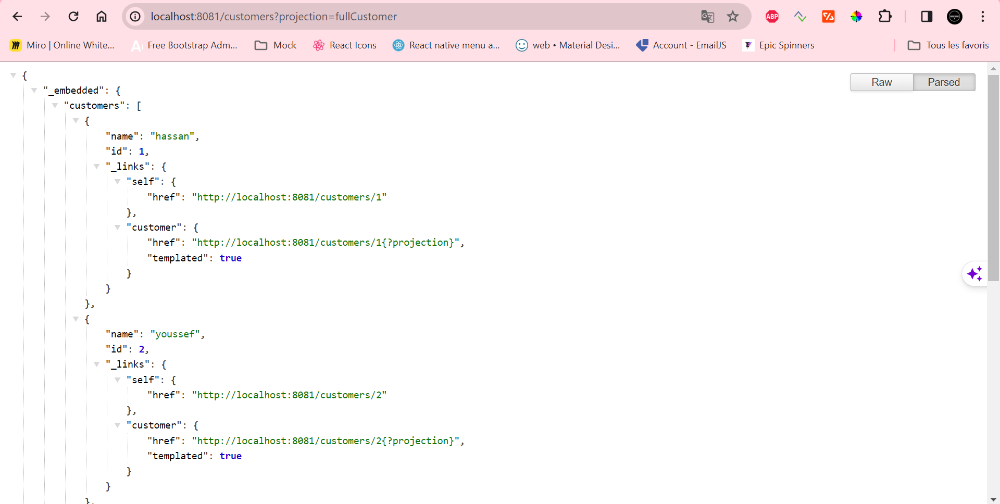
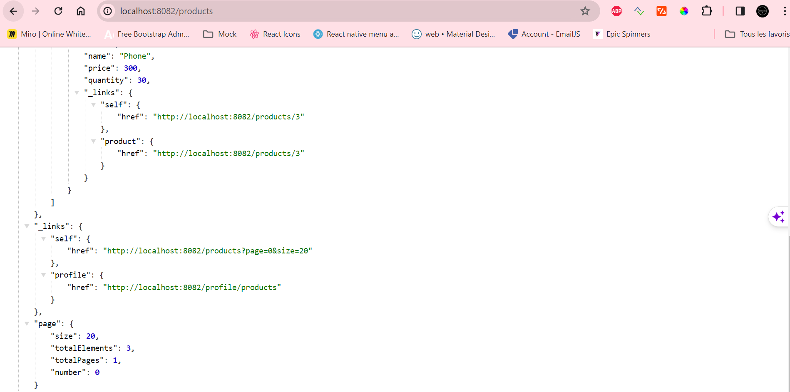
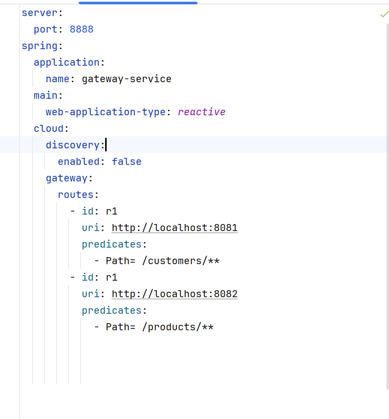
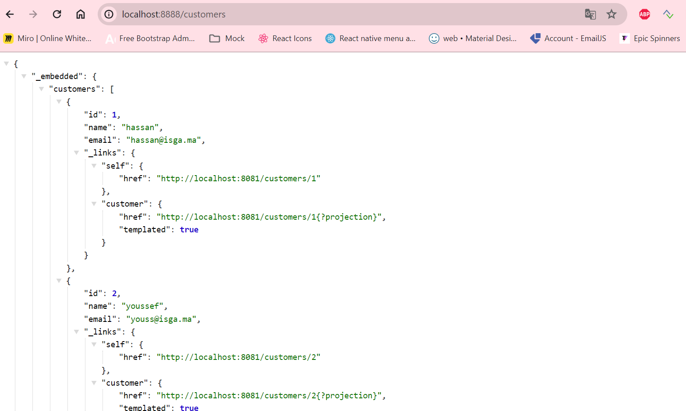
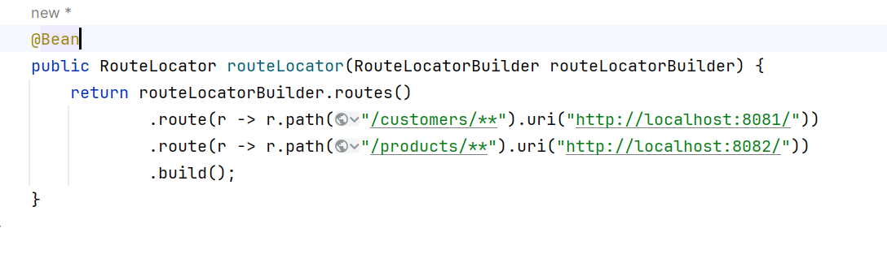
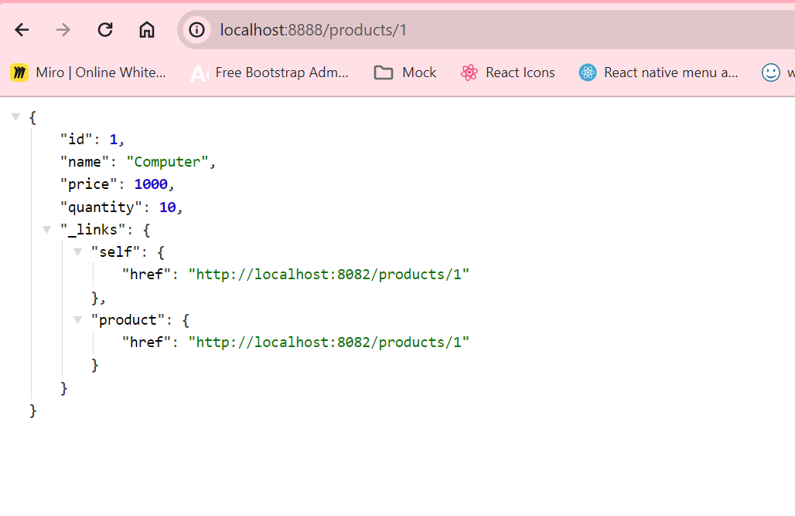
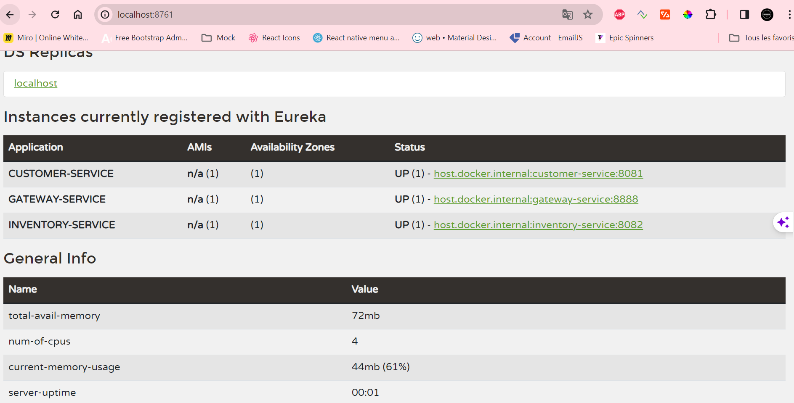
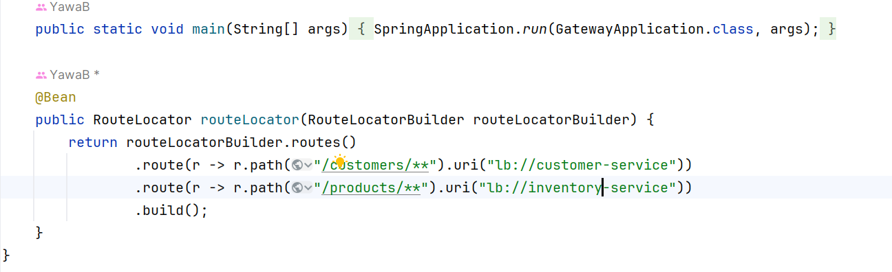
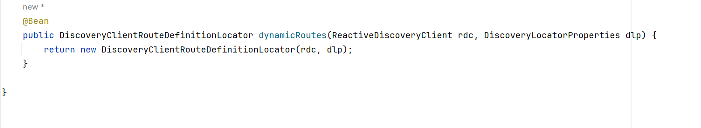
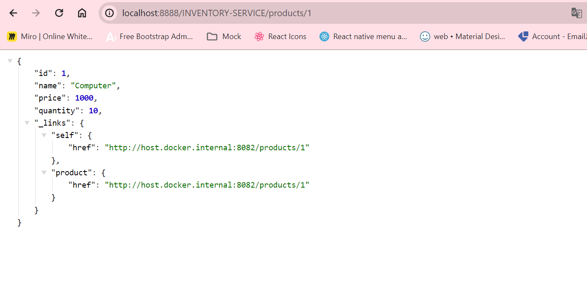

<h1>E-COM | SPRING PROJECT</h1>
<h3>Customer Microservice Open on the port 8081</h3>

Repository Rest Controller with Projections

<h3>Inventory Microservice Open on the port 8082</h3>

Repository Rest Controller

<h3>Gateway Static Configuration and Test</h3>

Gateway application.yml configuration

Gateway working properly

Gateway application.yml configuration

Gateway configuration with a bean function

<h3>Discovery Service started</h3>

All services registering on Eureka discovery service

After enabling the discovery service, we can make a dynamic configuration for the gateway

<h3>Dynamic configuration of the Gateway</h3>

Dynamic config using the load balancer and it's still working properly

We can also make the routing dynamically by using a Bean function which return a DiscoveryClientRouteDefinitionLocator and get the microservice from the request

p>Our gateway still working

